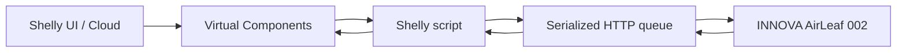
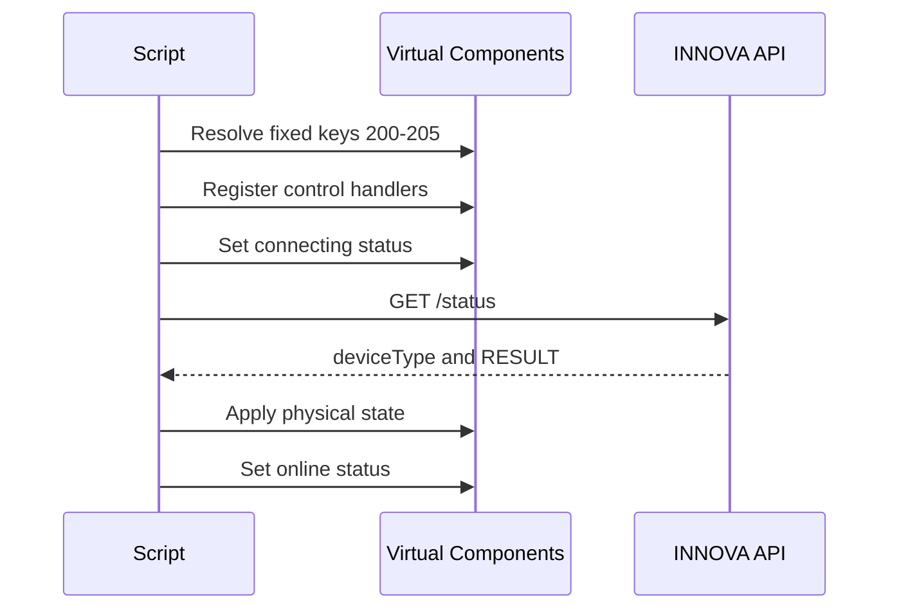
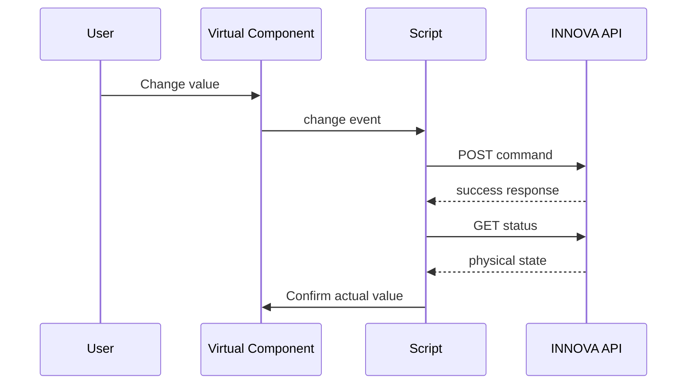

# Architecture

## Overview

The controller is a bidirectional bridge between the INNOVA AirLeaf local HTTP API and six Shelly Virtual Components.



## Component responsibilities

| Area | Responsibility |
|---|---|
| Virtual Components | User interface, cloud-visible state and command input |
| Event handlers | Validate user input and translate it into API paths and bodies |
| Request queue | Preserve ordering and prevent concurrent requests |
| HTTP callback | Validate transport status, decode JSON and process API success |
| Status decoder | Translate `ps`, `sp`, `ta`, `wm` and `fn` into Shelly values |
| Watchdog | Recover when no HTTP callback is delivered |
| Polling timer | Periodically reconcile Shelly with the physical device |

## Startup sequence



If any required handle is missing, initialization stops before event handlers and timers are registered.

## Request queue

`jobs` is a FIFO array. `activeJob` is either `null` or the single request currently being processed.

The queue follows these invariants:

1. At most one Shelly HTTP request is active.
2. `nextJob()` returns immediately while `activeJob` is not `null`.
3. Every callback clears `activeJob` before starting another request.
4. The watchdog also clears `activeJob` and discards queued commands.
5. Polling never queues a status read while another request is active or waiting.

## Late callback protection

Every started request receives a monotonically increasing identifier as Shelly callback user data. `activeRequestId` contains the identifier expected by the current request.

If the watchdog expires and a delayed callback later arrives, its identifier no longer matches. The callback returns without changing current state.

## Status transaction

A valid status response must satisfy all of the following:

1. Shelly RPC error code is zero.
2. An HTTP response object exists.
3. HTTP status code is 200.
4. Response body is valid JSON.
5. JSON contains `success: true`.
6. JSON contains a `RESULT` object.
7. `deviceType`, converted to a string, equals `002`.

Only then is the physical state copied into the Virtual Components.

## Command transaction



The final value displayed by Shelly is always based on the subsequent physical status response.

## Feedback-loop prevention

The same Virtual Component events are used for user input and script synchronization. When `applyStatus()` writes a value, Shelly emits a change event with a source similar to `script:<id>`.

`isInternal()` ignores any event whose source begins with `script`. External changes from the UI, cloud or an integration are therefore handled, while synchronization writes are ignored.

## Temperature representation

Shelly presents temperature as a decimal number in degrees Celsius. INNOVA represents it as an integer in tenths of a degree.

Read conversion:

```text
Shelly value = INNOVA value / 10
```

Write conversion:

```text
INNOVA value = round(Shelly value × 10)
```

Before writing, the controller rounds the requested Shelly value to the nearest 0.5 °C and validates the inclusive 16–31 °C range.

## Power-before-mode behavior

If the last reported status indicates that the unit is off, a mode selection produces two queued commands:

1. `POST power/on`
2. `POST set/mode/<mode>`

This preserves their order without starting simultaneous HTTP requests.

## Failure recovery

| Failure | Recovery |
|---|---|
| HTTP/RPC error | Publish offline status, continue with next queued request |
| Invalid JSON | Publish error, continue with queue |
| API rejection | Publish error, continue with queue |
| Missing callback | Watchdog clears active request and queue |
| Invalid setpoint | Restore last known physical state |
| Missing component | Abort initialization |
| Temporary network outage | Regular polling retries later |

## Extension points

Future versions could add:

- Dynamic Virtual Component discovery.
- Additional INNOVA device types.
- Alarm and diagnostic field decoding.
- Authentication support.
- A configurable component-key mapping.
- RPC endpoints for third-party integrations.
- Optional MQTT publication.
- Automatic grouping or thermostat presentation.

Each extension should preserve command serialization, physical-state confirmation and feedback-loop protection.

